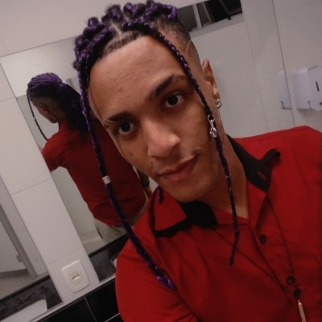

# 👨‍💻 Albert Nunes Dias — Portfólio

<p align="center">
  
</p>

<h3 align="center">
  Portfólio Profissional • Gestão da Tecnologia da Informação
</h3>

<p align="center">
  <a href="#-sobre-o-projeto">Sobre</a> •
  <a href="#-objetivos">Objetivos</a> •
  <a href="#-conteúdo">Conteúdo</a> •
  <a href="#-tecnologias">Tecnologias</a> •
  <a href="#-estrutura">Estrutura</a> •
  <a href="#-execução">Execução</a> •
  <a href="#-contato">Contato</a>
</p>

---

## 📌 Sobre o Projeto

Este repositório contém o **portfólio profissional de Albert Nunes Dias**, desenvolvido para apresentar, de maneira moderna, organizada e responsiva, informações relacionadas à sua formação acadêmica, qualificações profissionais, cursos, conhecimentos e experiências.

O projeto foi pensado para transformar as informações presentes no currículo em uma experiência digital mais completa, permitindo que recrutadores, empresas e outros profissionais conheçam o perfil acadêmico e profissional de forma rápida e visualmente agradável.

---

## 🎯 Objetivos

O principal objetivo do projeto é criar uma apresentação profissional na área de Tecnologia da Informação, reunindo em um único espaço:

* 🎓 Formação acadêmica;
* 💼 Experiências profissionais;
* 📚 Cursos de aperfeiçoamento;
* 💻 Conhecimentos em informática e tecnologia;
* 🧠 Qualificações profissionais;
* 📞 Informações de contato;
* 👤 Apresentação pessoal.

O projeto também serve como uma aplicação prática para desenvolvimento web e construção de uma presença profissional online.

---

## 👤 Sobre Albert

**Albert Nunes Dias** é estudante de **Gestão da Tecnologia da Informação** na Fatec Barueri – Padre Danilo José de Oliveira Ohl.

Possui formação de **Ensino Médio / Curso Técnico em T.I e Redes de Computador** pelo ITB Professor Munir José, concluída em novembro de 2021.

Também possui experiências profissionais como estagiário no **Instituto Avanço Tecnologia** e como **Operador de Telemarketing / Assistente de BackOffice na CSU CardSystem**.

### 🎯 Objetivo profissional

> Em Busca de uma oportunidade para desenvolver e melhorar meus conhecimentos e o desenvolvimento entre eu e a empresa.

---

## 🎓 Formação Acadêmica

### Fatec Barueri – Padre Danilo José de Oliveira Ohl

**Curso:** Gestão da Tecnologia da Informação

**Status:** Em andamento

### ITB Professor Munir José

**Curso:** Ensino Médio / Curso Técnico / T.I e Redes de computador

**Conclusão:** Novembro de 2021

---

## 💼 Experiência Profissional

### Instituto Avanço Tecnologia

**Cargo:** Estagiário

**Duração:** 4 meses

Durante o período de estágio, foram realizadas atividades como:

* Montagem de Art's;
* Criação de conteúdo;
* Manutenção preventiva;
* Acompanhamento de aula;
* Montagem de computadores;
* Rotinas administrativas.

### CSU CardSystem

Experiência profissional nas funções de:

* **Assistente de BackOffice**
* **Operador de Telemarketing**

---

## 📚 Cursos de Aperfeiçoamento

### 🇺🇸 Inglês — Wizard

**Duração:** Em andamento

### 📣 Marketing Pessoal

**Duração:** 234 horas

### 💻 Informática Master

**Duração:** 216 horas

---

## 🧠 Qualificações Profissionais

Entre as qualificações apresentadas no currículo estão:

* Experiência com o uso de computadores;
* Office Intermediário;
* Softwares e Hardwares.

---

## 💻 Conhecimentos

O portfólio apresenta os seguintes conhecimentos:

* Windows;
* Lógica de programação;
* Internet;
* Excel;
* Word;
* Access;
* PowerPoint;
* Manutenção Preventiva;
* Photoshop;
* CorelDraw;
* Liderança e gestão de pessoas.

---

## 🎨 Design

O projeto utiliza uma identidade visual baseada principalmente em três cores:

| Cor            | Função                                 |
| -------------- | -------------------------------------- |
| 🔵 **Azul**    | Cor principal e identidade tecnológica |
| 🟠 **Laranja** | Destaques e elementos de interação     |
| ⚪ **Branco**   | Fundos e equilíbrio visual             |

A interface foi planejada para transmitir uma combinação de:

* Tecnologia;
* Profissionalismo;
* Modernidade;
* Organização;
* Clareza.

---

## ✨ Funcionalidades

O portfólio foi desenvolvido com foco em uma experiência moderna e responsiva.

### Principais recursos

* 📱 Layout responsivo;
* 🖥️ Compatibilidade com desktops e notebooks;
* 📲 Adaptação para dispositivos móveis;
* 🧭 Navegação entre seções;
* 🖼️ Foto de perfil carregada localmente;
* 🎨 Identidade visual personalizada;
* ✨ Animações e transições;
* 🃏 Cards para apresentação das informações;
* 📚 Seções organizadas por categoria;
* 📞 Área de contato;
* ♿ Boas práticas de acessibilidade;
* 🔎 Estrutura preparada para SEO.

---

## 🖼️ Imagem de Perfil

A foto utilizada no portfólio é carregada localmente através do arquivo:

```text
public/photo.png
```

O arquivo deve permanecer nesse caminho para que a imagem seja carregada corretamente pela aplicação.

---

## 🛠️ Tecnologias

A implementação do projeto utiliza tecnologias modernas de desenvolvimento web.

Dependendo da configuração final do projeto, a stack pode incluir:

* **HTML5**
* **CSS3**
* **JavaScript**
* **React**
* **Vite**
* **TypeScript**
* **Tailwind CSS**

A tecnologia efetivamente utilizada deve ser considerada a definida nos arquivos do projeto.

---

## 📁 Estrutura do Projeto

Uma possível organização do projeto é:

```text
portfolio-albert/
│
├── public/
│   └── photo.png
│
├── src/
│   ├── components/
│   │   ├── Header
│   │   ├── Hero
│   │   ├── About
│   │   ├── Objective
│   │   ├── Education
│   │   ├── Qualifications
│   │   ├── Courses
│   │   ├── Experience
│   │   ├── Contact
│   │   └── Footer
│   │
│   ├── App
│   ├── main
│   └── styles
│
├── package.json
├── README.md
└── ...
```

A estrutura pode variar conforme a implementação final.

---

## 🚀 Execução Local

### 1. Clone o repositório

```bash
git clone SEU_LINK_DO_REPOSITORIO
```

### 2. Entre na pasta do projeto

```bash
cd portfolio-albert
```

### 3. Instale as dependências

Caso o projeto utilize Node.js:

```bash
npm install
```

### 4. Execute o projeto

```bash
npm run dev
```

Após iniciar o servidor de desenvolvimento, o terminal exibirá o endereço local para acessar o portfólio.

---

## 📦 Build para Produção

Para gerar uma versão otimizada para produção:

```bash
npm run build
```

Para visualizar a versão de produção localmente, caso o projeto possua o script correspondente:

```bash
npm run preview
```

---

## 📱 Responsividade

O projeto foi planejado para oferecer uma experiência consistente em diferentes tamanhos de tela.

### 🖥️ Desktop

A interface utiliza o espaço disponível para apresentar:

* Foto;
* Informações profissionais;
* Cards;
* Timeline;
* Navegação;
* Seções de conteúdo.

### 📱 Mobile

Em telas menores, os elementos são reorganizados para facilitar a leitura e interação.

O menu deve adaptar-se para um formato apropriado para dispositivos móveis, enquanto cards e conteúdos devem ocupar a largura disponível sem causar rolagem horizontal.

---

## ♿ Acessibilidade

O projeto busca seguir boas práticas de acessibilidade, incluindo:

* HTML semântico;
* Hierarquia adequada de títulos;
* Textos alternativos para imagens;
* Contraste adequado;
* Navegação por teclado;
* Estados de foco;
* Elementos interativos identificáveis.

A imagem de perfil utiliza o texto alternativo:

```text
Foto de Albert Nunes Dias
```

---

## 🔎 SEO

O projeto possui uma estrutura preparada para mecanismos de busca.

### Título

```text
Albert Nunes Dias | Portfólio Profissional
```

### Descrição

```text
Portfólio profissional de Albert Nunes Dias, estudante de Gestão da Tecnologia da Informação, com formação técnica em T.I e Redes de Computadores e experiências profissionais.
```

---

## 📞 Contato

### 📱 Celular

**(11) 95432-6956**

### 💬 WhatsApp

**(11) 97029-0233**

### 📧 E-mail

**[albertdias80@gmail.com](mailto:albertdias80@gmail.com)**

---

## 📌 Status do Projeto

🟢 **Em desenvolvimento / Portfólio pessoal**

O projeto pode receber futuras melhorias de design, acessibilidade, desempenho e funcionalidades conforme sua evolução profissional e acadêmica.

---

## 🔮 Possíveis melhorias futuras

Algumas funcionalidades podem ser adicionadas futuramente, como:

* [ ] Publicação do portfólio online;
* [ ] Domínio personalizado;
* [ ] Página dedicada a projetos;
* [ ] Seção de certificados;
* [ ] Integração com GitHub;
* [ ] Integração com LinkedIn;
* [ ] Formulário de contato;
* [ ] Tradução para inglês;
* [ ] Modo escuro;
* [ ] Melhorias contínuas de acessibilidade;
* [ ] Otimizações de desempenho.

Esses itens representam possibilidades futuras e não necessariamente funcionalidades já implementadas.

---

## 📄 Informações de Origem

As informações profissionais apresentadas neste projeto foram organizadas a partir do currículo de **Albert Nunes Dias**.

O portfólio busca preservar as informações originais e apresentá-las em formato digital, mantendo o foco na formação, qualificações, cursos e experiências profissionais.

---

## 👨‍💻 Autor

**Albert Nunes Dias**

🎓 Gestão da Tecnologia da Informação

📍 Barueri — São Paulo, Brasil

📧 **[albertdias80@gmail.com](mailto:albertdias80@gmail.com)**

---

<p align="center">
  Desenvolvido para apresentar minha trajetória acadêmica e profissional na área de Tecnologia da Informação.
</p>

<p align="center">
  ⭐ Se este projeto foi útil ou interessante, considere deixar uma estrela no repositório.
</p>
